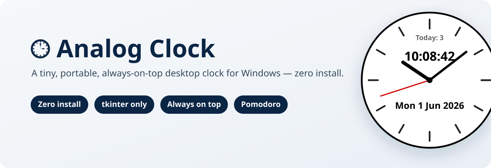
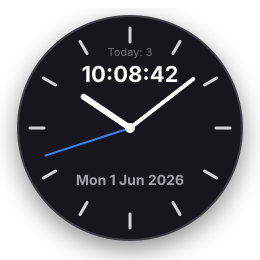

# 🕒 Analog Clock

[](LICENSE)
[](#-requirements--動作環境)
[](https://www.python.org/)
[](https://doc.qt.io/qtforpython/)
[](https://catalyst.tailwindui.com/)

> **いつも最前面に浮かぶ、今風のデスクトップ アナログ時計。** アナログ＋デジタル＋日付＋ポモドーロを、小さな1枚のウィンドウに。
> *A modern, always-on-top desktop analog clock with a built-in Pomodoro timer — analog + digital + date, all in one tiny window.*

### 🍎 macOS をお使いの方はこちら → **[docs/macos.md](docs/macos.md)**

*Using a Mac? See the dedicated macOS guide → [docs/macos.md](docs/macos.md)*

---

## 📸 Screenshot



文字盤のアナログ時計＋デジタル時刻＋日付（例: `Mon 1 Jun 2026`）、そして内蔵ポモドーロタイマー。すべてが小さな1つのウィンドウに収まっています。

---

## ✨ Features / 特徴

- **アナログ＋デジタル表示** — 針の時計と数字の時刻を同時に表示。*Analog hands + digital readout together.*
- **日付表示** — `Mon 1 Jun 2026` のように曜日・日・月・年をひと目で。*Date at a glance.*
- **🍅 内蔵ポモドーロタイマー** — 25分集中 / 5分休憩。`Today: N` でその日に完了した回数を自動カウント（日付ごとに保存）。
- **ドラッグで移動・位置を記憶** — つかんで好きな場所へ。次回も同じ場所に出ます。*Drag to move; position is remembered.*
- **サイズ変更** — 右クリックメニューから XS〜XL のプリセットで拡大・縮小。
- **🌗 Light / Dark テーマ** — 右クリックメニューから切り替え（既定は Light）。選択は保存されます。
- **常に最前面（always-on-top）** — 他のウィンドウに隠れません。
- **なめらかな描画** — アンチエイリアス + やわらかいドロップシャドウ + 角丸（Catalyst デザイン）。*Anti-aliased, soft drop shadow, rounded — smooth blue second hand.*
- **多重起動を防止 / 自動復活** — 二重に開かず、クラッシュ・再起動後も自動で戻ります。*Single-instance + auto-revive.*

---

## 🔀 2つの版の選び方 / Which one should I run?

このプロジェクトには **2つの時計プログラム** が入っています。基本は **`clock_qt.py`（推奨）** を使ってください。

| | **`clock_qt.py`** 🌟 今風・推奨 | **`clock.pyw`** 軽量・ゼロ依存 |
|---|---|---|
| 見た目 (Look) | なめらか（アンチエイリアス + 影 + 角丸）<br>*smooth, anti-aliased, soft shadow* | シンプル（アンチエイリアスなし）<br>*basic, non-anti-aliased* |
| 技術 (Built with) | **PySide6 (Qt)** | **Python 標準ライブラリ (tkinter)** |
| インストール (Install) | `pip install PySide6-Essentials` が必要 | **不要・ゼロインストール** *(zero-install)* |
| メモリ (RAM) | 約 60 MB | ごくわずか *(tiny)* |
| 対応 OS | Windows 11 + macOS | Windows + macOS |
| こんな人に | きれいな見た目で常用したい人（おすすめ） | `pip install` できない / 最軽量がいい人 |

> 💡 **迷ったら `clock_qt.py`。** `pip install` が使えない環境や、とにかく軽くしたいときだけ `clock.pyw` を選びます。
> *When in doubt, run `clock_qt.py`. Pick the lite `clock.pyw` only if you can't pip install.*
>
> 機能（アナログ＋デジタル＋日付＋ポモドーロ、ドラッグ移動、サイズ変更、最前面、右クリックメニュー、テーマ、設定の保存）は **両方とも共通** です。

---

## 🚀 Quick Start (Windows) / すぐ使う

1. このリポジトリをダウンロード（または `git clone`）します。
2. 依存パッケージを入れます（推奨版 `clock_qt.py` 用）:

   ```sh
   pip install PySide6-Essentials
   ```

3. 起動します。次のどちらかでOK:

   - `start_clock.vbs` を **ダブルクリック**（コンソール画面が出ません ✨ / 推奨）
   - もしくはコマンドで `pythonw clock_qt.py`

   ```sh
   pythonw clock_qt.py
   ```

> 🪶 メモリ使用量は **約 60 MB** と軽量です。*Lightweight — about 60 MB RAM.*
>
> 💡 `pip install` を使えない環境なら、依存ゼロの **`clock.pyw`** をダブルクリックするだけでも動きます（見た目はシンプル版）。

```text
AnalogClock-oss/
├── clock_qt.py       ← 本体・推奨（PySide6 / Qt）
├── clock.pyw         ← 軽量・ゼロ依存版（tkinter）
└── start_clock.vbs   ← コンソール無しで clock_qt.py を起動するランチャー
```

---

## 🎮 Controls / 操作方法

### 🖱️ 右クリックメニュー (Right-click menu)

右クリックメニューは Tailwind **Catalyst** の **Dropdown**（`blue-500` ホバー）でテーマ化され、選択中の Light / Dark に追従します。

| 項目 (Item) | 動作 (Action) | ショートカット |
|------|------|------|
| **Start Pomodoro** | ポモドーロを開始 | `P` |
| **Pause / Resume** | 一時停止・再開 | `Space` |
| **Reset** | リセット | `R` |
| **Theme ▸ Light / Dark** | テーマ切り替え（既定 Light） | — |
| **Size ▸ XS / S / M / L / XL** | サイズ変更 | — |
| **Quit** | 終了 | `Esc` |

### ⌨️ キーボード (Keyboard)

| キー | 動作 |
|------|------|
| `P` | ポモドーロ開始 (Start) |
| `Space` | 一時停止 / 再開 (Pause / Resume) |
| `R` | リセット (Reset) |
| `Esc` | 終了 (Quit) |

> 🖱️ 時計を **ドラッグ** すると好きな位置へ移動できます（位置は記憶されます）。
> 設定（テーマ・サイズ・位置など）は **`settings.json`** に保存され、次回も引き継がれます。

---

## 🔁 Auto-start / 自動起動（Windows）

PC を再起動しても、スリープから復帰しても、万一クラッシュしても、時計が **自動で復活** するように二重で仕込みます。

1. **スタートアップ フォルダのショートカット** — ログイン時に自動で起動します。
2. **タスク スケジューラのタスク（`AnalogClockWatchdog`）** — 3分おきにチェックし、動いていなければ起動し直します。バッテリー対応・実行時間の制限なし。
   → クラッシュ・スリープ・再起動のあとでも **自動復旧** します。

> ✅ どちらも `pythonw` で `clock_qt.py` を直接起動します。*Both launch the clock via `pythonw` — survives crash / sleep / reboot.*
> 🍎 macOS では `launchd` LaunchAgent（`KeepAlive`）が同じ役割を果たします → **[docs/macos.md](docs/macos.md)**

---

## 🎨 Customization / カスタマイズ

UI は Tailwind の **Catalyst** デザイン言語で統一されています（フォント **Inter**、ニュートラルは **zinc** パレット、アクセントは **blue-500** の秒針・ホバー）。**Light（既定）/ Dark** の2テーマを内蔵。

`clock_qt.py` の先頭にある定数を書き換えれば、色・サイズ・ポモドーロの時間などを調整できます。
*Edit the constants at the top of `clock_qt.py` to tweak colors, size, and Pomodoro durations.*

| 定数 (Constant) | 意味 (What it does) |
|-----------------|---------------------|
| `WINDOW_SIZE` | ウィンドウの大きさ（ピクセル） |
| `FONT_SIZE` | デジタル時刻・日付の文字サイズ |
| `UPDATE_MS` | 画面の更新間隔（ミリ秒） |
| `*_COLOR`（各色） | 各パーツの色（既定は Catalyst の zinc / blue-500） |
| `POMO_WORK_MIN` | ポモドーロの作業時間（分・既定25） |
| `POMO_BREAK_MIN` | ポモドーロの休憩時間（分・既定5） |

---

## 🔧 How it works / 仕組み

- **`clock_qt.py`** は **PySide6 (Qt)** の `QPainter` でアンチエイリアス描画。やわらかいドロップシャドウ + 角丸 + なめらかな blue-500 の秒針。
- **`clock.pyw`** は **tkinter Canvas** に同じ要素を描く、依存ゼロの軽量版。
- **常に最前面** はウィンドウフラグ、**設定**（テーマ・サイズ・位置・ポモドーロ）は **`settings.json`** に保存します。
- **多重起動の防止** で、すでに起動中なら新しいプロセスはすぐ終了。
- **コンソール非表示** は `start_clock.vbs`（Windows）や `.command`（macOS）ランチャーによるものです。

---

## 💻 Requirements / 動作環境

- **OS:** Windows 11 / macOS
- **Python:** 3
- **推奨版 `clock_qt.py`:** `pip install PySide6-Essentials`（メモリ約 60 MB）
- **軽量版 `clock.pyw`:** 依存なし — `pip install` 不要・ゼロインストール（標準ライブラリ `tkinter`）

---

## 📄 License / ライセンス

**MIT License** — 自由に使って・改変して・配布できます。*Free to use, modify, and distribute.*

- **Author:** [niki-nakamura](https://github.com/niki-nakamura)
- **Organization:** Hyphen Technologies — これが最初の OSS プロジェクトです 🎉 *(our first open-source project)*
- 詳細は [LICENSE](LICENSE) をご覧ください。

---

<p align="center"><sub>Made with 🕒 + 🍅 by <a href="https://github.com/niki-nakamura">niki-nakamura</a> @ Hyphen Technologies</sub></p>
